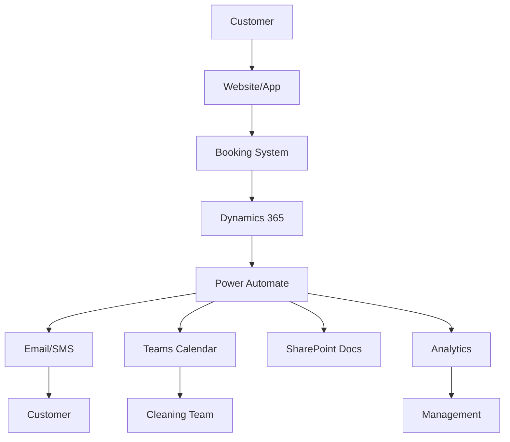

# 🎯 AURA SPRING CLEANING - CUSTOMER EXPERIENCE AUDIT

## Executive Summary
**Current State:** Partially automated with significant gaps in customer journey
**Critical Missing:** Customer follow-ups, pricing optimization, retention systems, feedback loops
**Immediate Priorities:** Deploy Dynamics 365 workflows, implement drip campaigns, set up analytics

---

## 🚨 CRITICAL GAPS IDENTIFIED

### 1. **NO AUTOMATED FOLLOW-UPS** ❌
**Impact:** Lost revenue, poor retention
- No post-service follow-up emails
- No satisfaction surveys
- No review requests
- No rebooking reminders
- No birthday/holiday greetings

### 2. **NO PRICING INTELLIGENCE** ❌
**Impact:** Leaving money on the table
- No dynamic pricing based on demand
- No competitor price tracking
- No discount optimization
- No seasonal pricing adjustments
- No customer lifetime value calculation

### 3. **NO RETENTION SYSTEM** ❌
**Impact:** High customer churn
- No loyalty program
- No referral rewards
- No win-back campaigns
- No churn prediction
- No VIP customer identification

### 4. **DYNAMICS 365 NOT DEPLOYED** ❌
**Impact:** Manual processes, no insights
- Customer records not syncing
- No sales pipeline
- No automated workflows
- No reporting dashboards
- No team performance tracking

---

## 📊 COMPLETE CUSTOMER JOURNEY ANALYSIS

### **PHASE 1: DISCOVERY** 
*How customers find you*

#### ✅ WHAT WE HAVE:
- Website with SEO
- Google Ads tracking
- Facebook Pixel
- Location pages

#### ❌ WHAT'S MISSING:
- **Google My Business automation** - Auto-respond to reviews
- **Social media scheduling** - Consistent presence
- **Content marketing system** - Blog posts, tips
- **Local SEO monitoring** - Track rankings
- **Competitor monitoring** - Price/service changes

---

### **PHASE 2: INITIAL CONTACT**
*First interaction with prospect*

#### ✅ WHAT WE HAVE:
- Booking form on website
- Phone number displayed
- Basic email capture

#### ❌ WHAT'S MISSING:
- **Live chat with AI** - Instant responses
- **SMS text-to-book** - "Text CLEAN to 737-330-1489"
- **Abandoned cart recovery** - Form abandonment emails
- **Lead scoring** - Prioritize hot leads
- **Instant quote calculator** - Price transparency
- **WhatsApp Business** - International clients

---

### **PHASE 3: QUOTE & BOOKING**
*Converting lead to customer*

#### ✅ WHAT WE HAVE:
- Online booking form
- Email confirmation
- Teams notification

#### ❌ WHAT'S MISSING:
- **Smart scheduling** - AI-optimized routes
- **Availability checker** - Real-time calendar
- **Upsell suggestions** - "Add window cleaning?"
- **Payment plans** - Subscription options
- **Booking abandonment recovery** - Follow-up incomplete bookings
- **Mobile app booking** - Native experience

---

### **PHASE 4: PRE-SERVICE**
*Between booking and service*

#### ✅ WHAT WE HAVE:
- Confirmation email
- Calendar event created

#### ❌ WHAT'S MISSING:
- **48-hour reminder** - SMS + Email
- **Day-before confirmation** - "We'll see you tomorrow!"
- **Team assignment notification** - "Maria will be your cleaner"
- **Preparation tips** - "Please secure pets"
- **Weather alerts** - Rescheduling if needed
- **Route optimization** - Notify if running late

---

### **PHASE 5: SERVICE DAY**
*During the cleaning*

#### ✅ WHAT WE HAVE:
- Team has address
- Basic service checklist

#### ❌ WHAT'S MISSING:
- **Check-in notification** - "Team has arrived"
- **Progress updates** - "50% complete"
- **Photo documentation** - Before/after
- **Quality checklist** - Digital verification
- **Completion notification** - "Service complete!"
- **Instant feedback** - Quick satisfaction check
- **Digital invoice** - Immediate billing

---

### **PHASE 6: POST-SERVICE**
*Immediately after cleaning*

#### ✅ WHAT WE HAVE:
- Basic completion tracking

#### ❌ WHAT'S MISSING:
- **2-hour follow-up** - "How was your service?"
- **24-hour survey** - Detailed feedback
- **Review requests** - Google, Yelp, Facebook
- **Referral request** - "Know someone who needs cleaning?"
- **Next booking suggestion** - "Schedule your next cleaning"
- **Thank you note** - Personal touch
- **Issue resolution** - Immediate problem solving

---

### **PHASE 7: RETENTION**
*Keeping customers long-term*

#### ✅ WHAT WE HAVE:
- Customer email list

#### ❌ WHAT'S MISSING:
- **Loyalty program** - Points, rewards
- **VIP tiers** - Gold, Silver, Bronze
- **Birthday rewards** - Special discounts
- **Anniversary recognition** - "1 year with us!"
- **Seasonal campaigns** - Spring cleaning specials
- **Win-back campaigns** - Re-engage dormant
- **Subscription model** - Monthly plans
- **Customer portal** - Manage bookings

---

### **PHASE 8: REFERRALS**
*Growing through word-of-mouth*

#### ✅ WHAT WE HAVE:
- Manual referral tracking

#### ❌ WHAT'S MISSING:
- **Referral program** - Give $20, Get $20
- **Referral tracking** - Automated codes
- **Social sharing** - Easy share buttons
- **Review incentives** - Rewards for reviews
- **Partner program** - Real estate agents
- **Corporate accounts** - B2B referrals
- **Influencer partnerships** - Local influencers

---

## 🔧 TECHNICAL SYSTEMS NEEDED

### **1. DYNAMICS 365 CONFIGURATION** 🔴 URGENT
```
Entities to Create:
- Customers (with all contact history)
- Bookings (linked to customers)
- Services (types, pricing)
- Teams (cleaner assignments)
- Feedback (surveys, reviews)
- Referrals (tracking sources)

Workflows Needed:
- New customer onboarding
- Booking confirmation sequence
- Service completion flow
- Follow-up automation
- Win-back campaigns
- Referral tracking
```

### **2. POWER AUTOMATE FLOWS** 🔴 URGENT
```
Critical Flows:
1. Abandoned Booking Recovery
2. 48-Hour Service Reminder
3. Post-Service Survey
4. Review Request Sequence
5. Monthly Subscription Billing
6. Referral Reward Processing
7. Birthday/Anniversary Greetings
8. Seasonal Campaign Triggers
9. Team Performance Reports
10. Revenue Analytics
```

### **3. EMAIL MARKETING SYSTEM** 🔴 URGENT
```
Campaigns Needed:
- Welcome Series (5 emails)
- Post-Service Series (3 emails)
- Monthly Newsletter
- Seasonal Promotions
- Win-Back Series (4 emails)
- Referral Program Announcement
- VIP Customer Exclusives
- Birthday/Anniversary
```

### **4. SMS MARKETING** 🟡 HIGH PRIORITY
```
Using Teams Phone (737) 330-1489:
- Booking confirmations
- Service reminders
- Arrival notifications
- Completion alerts
- Review requests
- Special offers
- Emergency rescheduling
```

### **5. ANALYTICS & REPORTING** 🟡 HIGH PRIORITY
```
Dashboards Needed:
- Customer Acquisition Cost
- Lifetime Value
- Churn Rate
- Service Completion Rate
- Customer Satisfaction Score
- Team Performance
- Revenue by Service Type
- Geographic Heat Maps
- Referral Sources
- Campaign ROI
```

### **6. PRICING OPTIMIZATION** 🟡 HIGH PRIORITY
```
Systems Needed:
- Dynamic pricing engine
- Demand forecasting
- Competitor price tracking
- Discount optimization
- Bundle recommendations
- Surge pricing for busy times
- Customer segment pricing
```

---

## 📋 IMPLEMENTATION ROADMAP

### **WEEK 1: Foundation** 🚀
- [ ] Configure Dynamics 365 entities
- [ ] Set up customer data sync
- [ ] Create booking workflow
- [ ] Build follow-up email templates
- [ ] Set up SMS notifications

### **WEEK 2: Automation** 🤖
- [ ] Deploy Power Automate flows
- [ ] Configure email campaigns
- [ ] Set up review requests
- [ ] Implement referral tracking
- [ ] Create loyalty program

### **WEEK 3: Intelligence** 🧠
- [ ] Build analytics dashboards
- [ ] Implement pricing optimization
- [ ] Set up A/B testing
- [ ] Configure lead scoring
- [ ] Create customer segments

### **WEEK 4: Optimization** 📈
- [ ] Launch drip campaigns
- [ ] Test all workflows
- [ ] Train team on systems
- [ ] Monitor performance
- [ ] Iterate and improve

---

## 💰 EXPECTED IMPACT

### **Revenue Increase: 40-60%**
- 20% from retention improvements
- 15% from pricing optimization
- 10% from upsells/cross-sells
- 15% from referrals

### **Cost Reduction: 30%**
- Less manual work
- Better route optimization
- Reduced customer service calls
- Lower acquisition costs

### **Customer Satisfaction: +25%**
- Faster response times
- Proactive communication
- Personalized service
- Issue prevention

---

## 🚨 IMMEDIATE ACTIONS REQUIRED

1. **TODAY:**
   - Set up Dynamics 365 customer entity
   - Create first Power Automate flow
   - Draft follow-up email templates

2. **THIS WEEK:**
   - Configure SMS notifications
   - Build review request sequence
   - Set up basic analytics

3. **THIS MONTH:**
   - Launch loyalty program
   - Implement pricing optimization
   - Deploy all automations

---

## 🎯 SUCCESS METRICS

### **30 Days:**
- 50% of customers receiving follow-ups
- 25% increase in reviews
- 15% reduction in no-shows

### **60 Days:**
- 80% automation coverage
- 30% increase in rebookings
- 20% increase in average order value

### **90 Days:**
- 95% customer satisfaction
- 40% revenue increase
- 50% reduction in manual tasks

---

## 🔐 SYSTEMS INTEGRATION MAP



---

## 📞 SUPPORT & TRAINING NEEDS

### **Team Training Required:**
- Dynamics 365 navigation
- Mobile app usage
- Customer communication standards
- Review response templates
- Upselling techniques

### **Documentation Needed:**
- Customer journey map
- Email/SMS templates
- Workflow diagrams
- Troubleshooting guide
- Performance metrics guide

---

*Created: 2025-08-19*
*Status: CRITICAL GAPS IDENTIFIED - IMMEDIATE ACTION REQUIRED*
*Next Review: 2025-08-26*